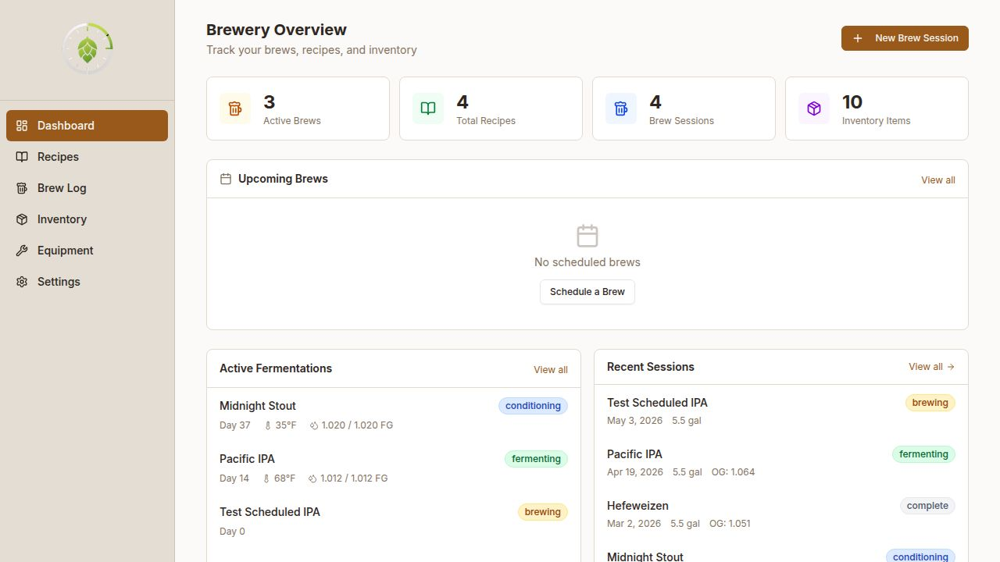
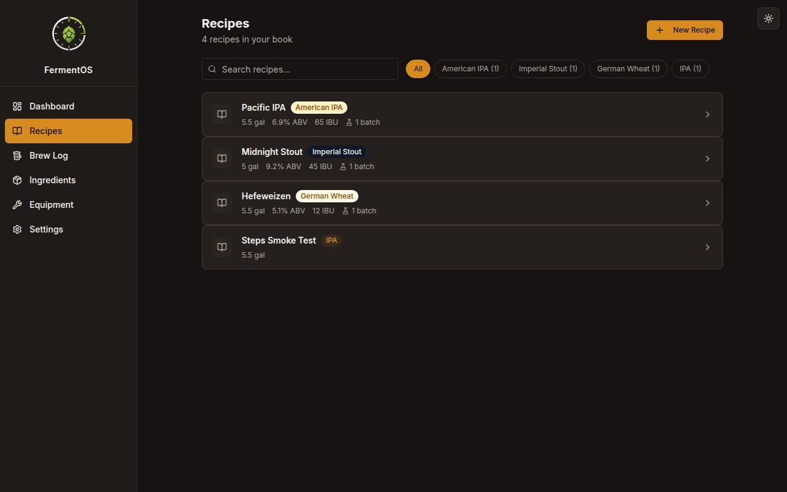
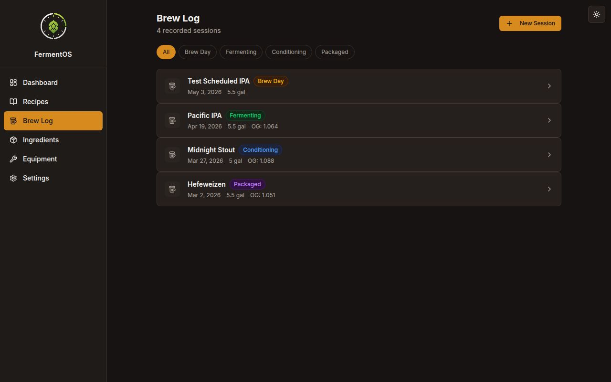
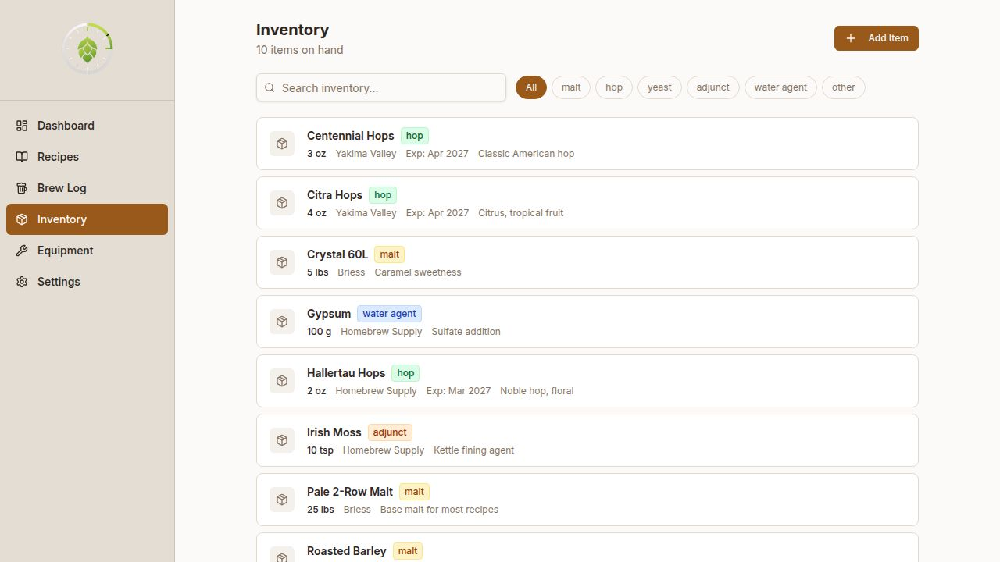
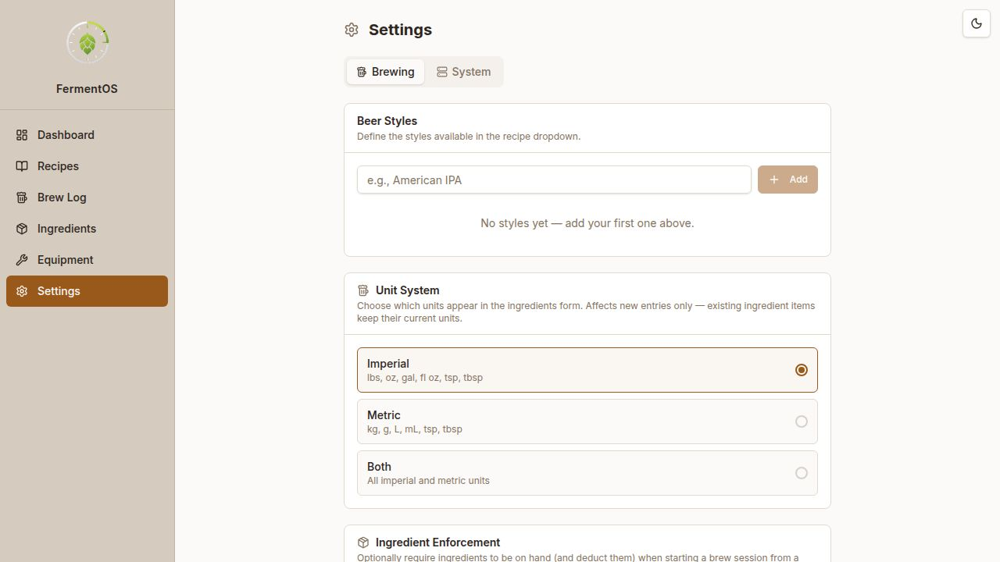

# FermentOS

A self-hosted web app for home brewers to manage recipes, log brew sessions, track fermentation, and monitor ingredient inventory. Designed to run on a small always-on host on your home network — a Raspberry Pi, mini PC, NAS, or any Debian-based Linux box.

## Screenshots


*Dashboard — at-a-glance brewery overview with active fermentations and recent sessions*

| Recipes | Brew Log |
| :---: | :---: |
|  |  |
| Browse and search your recipe book | Track every batch from grain to glass |


*Ingredients — keep tabs on malts, hops, yeast, and adjuncts with expiration tracking*


*Settings — manage beer styles, unit system, ingredient enforcement, scheduled SFTP backups, API access, in-app updates, and host reboots*

## Brew session lifecycle

Brew sessions move through four stages in a linear progression:

```
brew_day  ──▶  fermenting  ──▶  conditioning  ──▶  packaged
```

All new sessions start at **Brew Day**. The stage bar on the session detail
page lets you advance (or revert) to any stage with a single click. Every
status change is recorded in a timestamped history log visible on the session
page.

`brewDate` records the actual day grain hit the kettle.

## Features

- **Recipe Manager** — Create and store beer recipes with full ingredient lists, gravity targets, ABV, IBU, and color
- **Brew Log** — Log brew sessions, track status from grain to glass (brew_day → fermenting → conditioning → packaged)
- **Response & Stage History** — Every brew session records a timestamped log each time the status changes, always visible on the session page
- **Tasting Notes & Photo** — Attach a photo, star rating, and tasting notes to any session
- **Fermentation Tracker** — Record temperature, gravity, and pH readings over time with an interactive chart
- **Ingredients** — Track your malts, hops, yeast, and adjuncts with quantities, suppliers, and expiry dates. The unit field is a dropdown filtered by your unit system preference
- **Beer Styles** — Define your own style list (Settings) used as a dropdown when creating recipes
- **Unit System** — Choose Imperial, Metric, or Both in Settings → Brewing. Controls which units appear in the inventory form; existing items keep their stored units
- **Dashboard** — At-a-glance view of active fermentations and recent sessions
- **iSpindel Integration** — Receive live gravity, temperature, battery, and angle readings from iSpindel Wi-Fi hydrometers. Devices auto-register on first POST, readings are mirrored into the fermentation chart, and a live telemetry card appears on the brew session page when a device is assigned

## Tech Stack

- **Frontend**: React + Vite + TypeScript + Tailwind CSS
- **Backend**: Node.js + Express + TypeScript
- **Database**: PostgreSQL
- **ORM**: Drizzle ORM
- **Package Manager**: pnpm (monorepo workspace)

---

## Self-Host Installation

### Requirements

- Any Debian-based 64-bit Linux host (Raspberry Pi OS, Ubuntu, Debian, etc.)
- Raspberry Pi 3B+ or newer (Pi 4 recommended) works great, but a mini PC, NAS, or VM works just as well
- At least 8 GB SD card
- Internet connection

### Quick install

Clone the repo and run the installer:

```bash
git clone https://github.com/highaltidude/FermentOS.git
cd FermentOS
bash install.sh
```

During the install you'll be prompted for the **web port** the app should listen on (default `3000`). Pick any free port between 1–65535; this is the port you'll open in the browser. To skip the prompt (e.g. for unattended installs), set `FERMENTOS_PORT` first: `FERMENTOS_PORT=8080 bash install.sh`.

The script will:
- Install Node.js, pnpm, and PostgreSQL (if not already installed)
- Create the database and generate a random secure password
- Create your `.env` file automatically (including the port you chose)
- Install dependencies, run migrations, and build the app
- Register and start the systemd service so it survives reboots

When it finishes, it prints the URL to open in your browser (e.g. `http://192.168.1.42:3000`).

### Docker Installation

Recommended for NAS, mini PC, VM, or anyone already running Docker.

```bash
git clone https://github.com/highaltidude/FermentOS.git
cd FermentOS
bash docker-install.sh
```

The script will prompt for a web port (default 3000), generate secure random credentials, write `.env`, and start the stack. Open the URL it prints when done.

- Data is persisted in a Docker volume (`postgres_data`); uploaded photos are stored in `./data/uploads`
- To update: `git pull && docker compose up -d --build`

**Non-interactive / unattended install:**
```bash
FERMENTOS_PORT=7070 bash docker-install.sh
```

**Raspberry Pi / ARM:**
```bash
docker compose build --build-arg BUILD_TARGET=linux/arm64
docker compose up -d
```

---

### Useful commands after install

```bash
sudo systemctl status fermentos         # check service status
sudo journalctl -u fermentos -f         # tail logs
sudo systemctl restart fermentos        # restart the app
```

### Updating

The easiest way to update is from the app itself: **Settings → System → App Update → Update now**. It pulls the latest commit, runs migrations, rebuilds, and restarts the services automatically, with a live progress bar.

To update manually from the command line instead:

```bash
cd FermentOS
bash update.sh
```

Or step by step:

```bash
cd FermentOS
git pull
pnpm install
source .env && pnpm --filter @workspace/db run push
pnpm --filter @workspace/api-server run build
BASE_PATH=/ pnpm --filter @workspace/fermentos run build
sudo systemctl restart fermentos
```

### Accessing on your local network

The installer prints your host's IP when it finishes. You can also find it any time with:

```bash
hostname -I
```

Visit `http://<host-ip>:3000` from any device on the same network. For a stable address, assign your host a static IP in your router's DHCP settings.

---

### Manual installation (optional)

<details>
<summary>Click to expand manual step-by-step instructions</summary>

**1. Update the system**
```bash
sudo apt update && sudo apt upgrade -y
```

**2. Install Node.js v20**
```bash
curl -fsSL https://deb.nodesource.com/setup_20.x | sudo -E bash -
sudo apt install -y nodejs
```

**3. Install pnpm and serve**
```bash
npm install -g pnpm serve
```

**4. Install PostgreSQL and create the database**
```bash
sudo apt install -y postgresql postgresql-contrib
sudo systemctl enable --now postgresql
sudo -u postgres psql <<EOF
CREATE USER fermentos WITH PASSWORD 'your_password_here';
CREATE DATABASE fermentos OWNER fermentos;
GRANT ALL PRIVILEGES ON DATABASE fermentos TO fermentos;
EOF
```

**5. Configure environment**
```bash
cp .env.example .env
nano .env   # fill in DATABASE_URL and SESSION_SECRET
```

**6. Install, migrate, build**
```bash
pnpm install
pnpm --filter @workspace/db run push
pnpm --filter @workspace/api-server run build
BASE_PATH=/ pnpm --filter @workspace/fermentos run build
```

**7. Start**
```bash
node --enable-source-maps artifacts/api-server/dist/index.mjs &
serve -s artifacts/fermentos/dist/public -l 3000
```

</details>

---

## API Reference

All endpoints are prefixed with `/api`. Replace `<host>` with your host's address (e.g. `http://192.168.1.239:8080`).

### Authentication

By default no authentication is required — the API is designed for trusted local network use.

You can optionally enable **API token lockdown** under **Settings → Security → API Access**. When enabled, all external clients (scripts, Home Assistant, integrations) must supply a token. Browser requests from the FermentOS UI itself continue to work without a token.

**Generating a token:** Settings → Security → API Access → enter a name → Create Token. Copy the token immediately — it is only shown once.

**Using a token** (either header works):
```
Authorization: Bearer <token>
X-Api-Key: <token>
```

**Home Assistant example:**
```yaml
sensor:
  - platform: rest
    name: "FermentOS Active Brews"
    resource: http://192.168.1.239:8080/api/dashboard/summary
    headers:
      Authorization: "Bearer <token>"
    value_template: "{{ value_json.activeBrews }}"
    scan_interval: 300
```

---

### Dashboard

| Method | Endpoint | Description |
|--------|----------|-------------|
| GET | `/api/dashboard/summary` | Counts of active brews, total recipes, and inventory items |
| GET | `/api/dashboard/active-brews` | List of currently active brew sessions |

---

### Recipes

| Method | Endpoint | Description |
|--------|----------|-------------|
| GET | `/api/recipes` | List all recipes |
| POST | `/api/recipes` | Create a recipe |
| GET | `/api/recipes/:id` | Get a recipe with its ingredients |
| PUT | `/api/recipes/:id` | Update a recipe |
| DELETE | `/api/recipes/:id` | Delete a recipe |
| GET | `/api/recipes/styles` | Recipe counts grouped by style |
| GET | `/api/recipes/:id/ingredients` | List ingredients for a recipe |
| POST | `/api/recipes/:id/ingredients` | Add an ingredient |
| PUT | `/api/ingredients/:id` | Update an ingredient |
| DELETE | `/api/ingredients/:id` | Delete an ingredient |

**POST /api/recipes** body:
```json
{
  "name": "Pacific IPA",
  "style": "American IPA",
  "batchSizeGallons": 5.5,
  "originalGravity": 1.065,
  "finalGravity": 1.012,
  "abv": 6.9,
  "ibu": 65,
  "colorSrm": 8,
  "notes": "Optional brew notes"
}
```

**POST /api/recipes/:id/ingredients** body:
```json
{
  "name": "Cascade Hops",
  "type": "hop",
  "amount": 2,
  "unit": "oz",
  "use": "boil",
  "time": 60,
  "notes": "Optional"
}
```
`type`: `malt` | `hop` | `yeast` | `adjunct` | `water_agent` | `other`
`use`: `mash` | `boil` | `whirlpool` | `dry_hop` | `other`

---

### Brew Sessions

| Method | Endpoint | Description |
|--------|----------|-------------|
| GET | `/api/brew-sessions` | List all brew sessions |
| POST | `/api/brew-sessions` | Create a brew session |
| GET | `/api/brew-sessions/:id` | Get a brew session with status log |
| PUT | `/api/brew-sessions/:id` | Update a brew session |
| DELETE | `/api/brew-sessions/:id` | Delete a brew session |
| GET | `/api/brew-sessions/:id/readings` | List fermentation readings |
| POST | `/api/brew-sessions/:id/readings` | Add a fermentation reading |
| DELETE | `/api/readings/:id` | Delete a fermentation reading |
| DELETE | `/api/status-log/:id` | Delete a status log entry |
| POST | `/api/brew-sessions/:id/photo` | Upload a session photo (multipart/form-data, field: `photo`) |
| DELETE | `/api/brew-sessions/:id/photo` | Remove the session photo |

**POST /api/brew-sessions** body:
```json
{
  "recipeId": 1,
  "recipeName": "Pacific IPA",
  "status": "brew_day",
  "brewDate": "2024-03-15",
  "batchSizeGallons": 5.5,
  "originalGravityActual": 1.064,
  "finalGravityActual": null,
  "abvActual": null,
  "rating": null,
  "notes": "Optional"
}
```
`status`: `brew_day` | `fermenting` | `conditioning` | `packaged`

**POST /api/brew-sessions/:id/readings** body:
```json
{
  "recordedAt": "2024-03-16T10:00:00Z",
  "temperature": 68.5,
  "gravity": 1.045,
  "ph": 4.2
}
```

---

### Inventory

| Method | Endpoint | Description |
|--------|----------|-------------|
| GET | `/api/inventory` | List all inventory items |
| POST | `/api/inventory` | Add an inventory item |
| PUT | `/api/inventory/:id` | Update an inventory item |
| DELETE | `/api/inventory/:id` | Delete an inventory item |

**POST /api/inventory** body:
```json
{
  "name": "Cascade Hops",
  "type": "hop",
  "amount": 8,
  "unit": "oz",
  "supplier": "MoreBeer",
  "purchasedDate": "2024-03-01",
  "expiryDate": "2025-03-01",
  "notes": "Optional"
}
```
`type`: `malt` | `hop` | `yeast` | `adjunct` | `water_agent` | `other`

---

### Equipment

| Method | Endpoint | Description |
|--------|----------|-------------|
| GET | `/api/equipment` | List all equipment |
| POST | `/api/equipment` | Add a piece of equipment |
| PUT | `/api/equipment/:id` | Update equipment |
| DELETE | `/api/equipment/:id` | Delete equipment |

**POST /api/equipment** body:
```json
{
  "name": "10 Gallon Kettle",
  "category": "kettle",
  "brand": "Ss Brewtech",
  "model": "Brew Kettle 10G",
  "condition": "good",
  "purchasedDate": "2023-01-15",
  "purchasePrice": "199.99",
  "serialNumber": "Optional",
  "notes": "Optional"
}
```
`condition`: `new` | `good` | `fair` | `poor`

---

### Settings — Beer Styles

| Method | Endpoint | Description |
|--------|----------|-------------|
| GET | `/api/settings/styles` | List all beer styles |
| POST | `/api/settings/styles` | Add a beer style |
| DELETE | `/api/settings/styles/:id` | Delete a beer style |

**POST /api/settings/styles** body:
```json
{ "name": "American IPA", "sortOrder": 1 }
```

---

### Settings — Unit System

| Method | Endpoint | Description |
|--------|----------|-------------|
| GET | `/api/settings/unit-system` | Get the current unit system preference |
| PUT | `/api/settings/unit-system` | Set the unit system preference |

**GET /api/settings/unit-system** response:
```json
{ "system": "imperial" }
```

**PUT /api/settings/unit-system** body:
```json
{ "system": "metric" }
```
`system`: `imperial` | `metric` | `both`

Unit lists by system:
- `imperial` — lbs, oz, gal, qt, pt, fl oz, tsp, tbsp, pkg, each
- `metric` — kg, g, L, mL, tsp, tbsp, pkg, each
- `both` — all of the above combined

The preference is stored in the database and defaults to `imperial` on a fresh install. Changing it only affects the dropdown options shown in the inventory form — existing inventory items keep whatever unit was stored when they were created.

---

### Sensors

| Method | Endpoint | Description |
|--------|----------|-------------|
| GET | `/api/sensors/devices` | List all registered sensor devices with latest reading, assignment, and connection status |
| POST | `/api/sensors/devices` | Manually register a device |
| GET | `/api/sensors/devices/:id` | Get a single device |
| PUT | `/api/sensors/devices/:id` | Rename a device |
| DELETE | `/api/sensors/devices/:id` | Delete a device and all its readings |
| POST | `/api/sensors/devices/:id/assign` | Assign a device to a brew session |
| DELETE | `/api/sensors/devices/:id/assign` | Unassign a device from its current brew session |
| GET | `/api/sensors/readings` | List raw sensor readings (filterable by `deviceId`, `brewSessionId`) |
| GET | `/api/brew-sessions/:id/sensor-telemetry` | Live telemetry for a brew: device info, latest reading, fermentation insights, alerts |

---

### iSpindel Integration

| Method | Endpoint | Description |
|--------|----------|-------------|
| POST | `/api/integrations/ispindel` | iSpindel ingest — receives the device's JSON payload; no auth token required |
| GET | `/api/integrations/ispindel/settings` | Get integration settings (enabled flag, token) |
| PUT | `/api/integrations/ispindel/settings` | Update integration settings |
| POST | `/api/integrations/ispindel/simulate` | Send a synthetic reading for development/testing |
| GET | `/api/integrations/ispindel/status` | HA-friendly status endpoint — returns latest reading from each device |

---

### Static Assets

Uploaded session photos are served at:
```
GET /api/uploads/sessions/<filename>
```

---

## iSpindel Setup

The iSpindel is an open-source Wi-Fi hydrometer that sends gravity, temperature, battery, and tilt angle readings over HTTP. FermentOS includes a native ingest endpoint so the iSpindel posts directly to your local server — no cloud account or relay required.

### 1. Enable the integration

In FermentOS, go to **Settings → System → Connectivity → iSpindel Integration** and confirm the toggle is on. The panel shows the exact POST URL to use.

### 2. Configure your iSpindel

Open the iSpindel's built-in web UI (connect it to your network in hotspot mode first, then visit `http://192.168.4.1`):

| Field | Value |
|-------|-------|
| Server Address | your FermentOS host IP (e.g. `192.168.1.100`) |
| Port | `80` |
| URL | `/api/integrations/ispindel` |
| Protocol | HTTP |

Leave all other fields at their defaults. The iSpindel's **Name** field becomes the `deviceKey` used to identify it in FermentOS.

### 3. First reading

On the next wake cycle the iSpindel will POST to FermentOS. If no device with that `deviceKey` exists yet, one is **auto-created** — you will see it appear in the Connectivity panel immediately after the first reading.

### 4. Assign to a brew session

In the Connectivity panel (or on the brew session page), select an active brew from the **Assign to brew…** dropdown. From that point on, every incoming reading is also mirrored into the session's fermentation chart and a live telemetry card appears at the top of the brew session page.

### 5. Optional: secure with a token

Set a **Security Token** in the Connectivity panel. Then open the iSpindel web UI and enter the same value in its **Token** field. FermentOS will reject readings that don't include the matching token.

> **Note:** The ingest endpoint (`POST /api/integrations/ispindel`) and the status endpoint (`GET /api/integrations/ispindel/status`) are always exempt from API key lockdown so the iSpindel device can reach them without a bearer token.

### Simulate a reading (development)

Expand the **Developer: Simulate iSpindel Reading** section in the Connectivity panel and click **Send Reading** — useful for testing before your device arrives or while debugging.

---

## Development

```bash
pnpm install
pnpm --filter @workspace/api-server run dev   # API on :8080
pnpm --filter @workspace/fermentos run dev   # Frontend on :23975
```

---

## License

MIT
