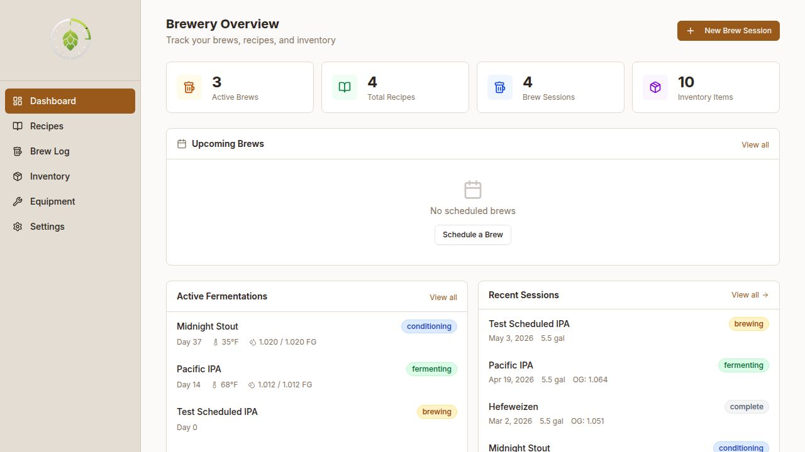
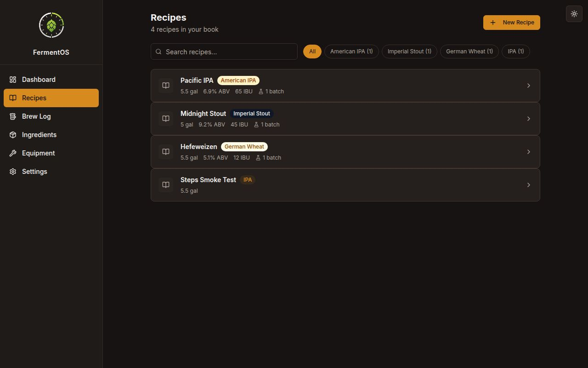
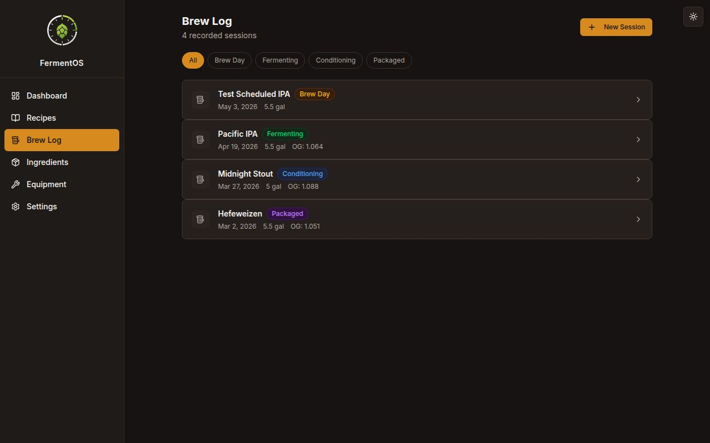
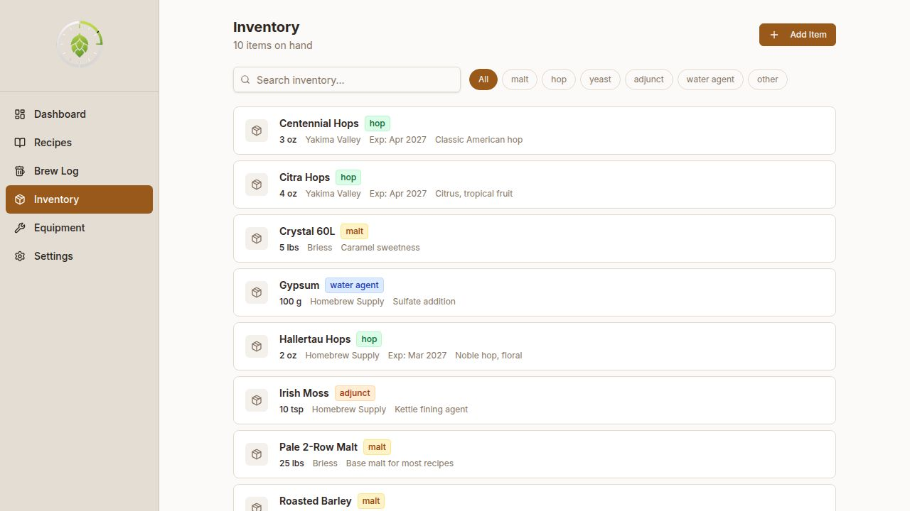
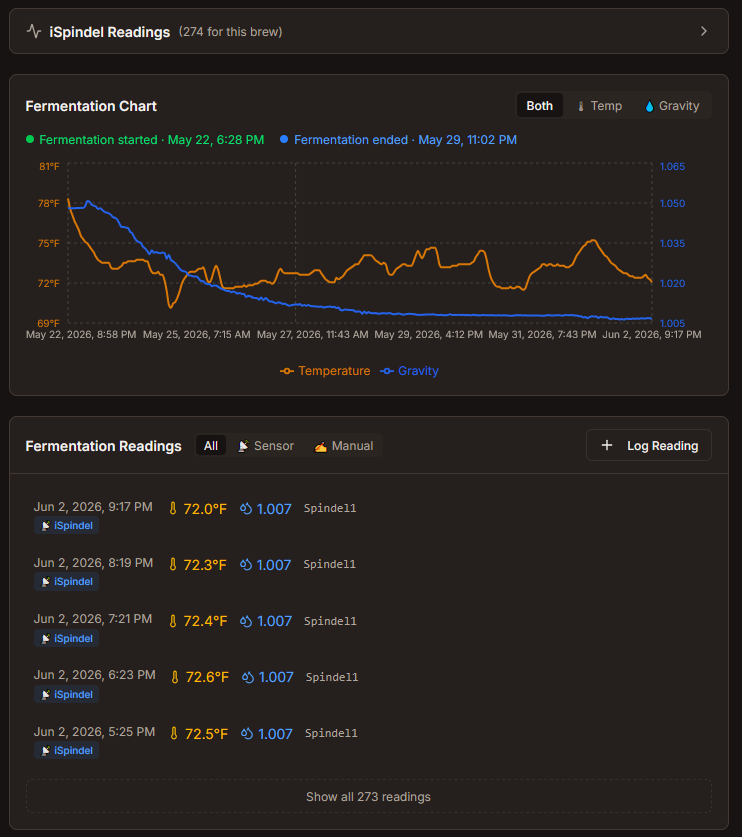
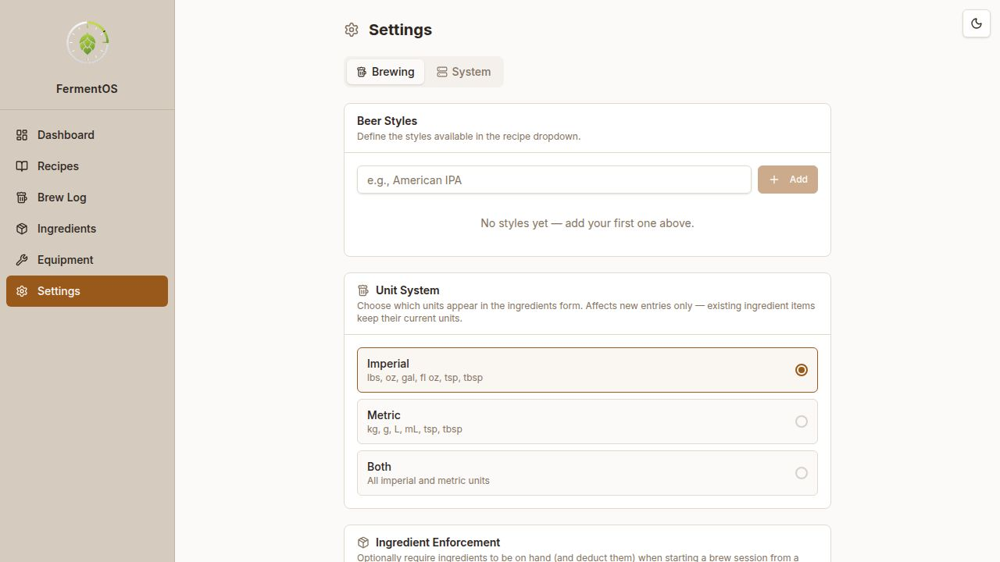

# FermentOS

## What is FermentOS

> Self-hosted homebrewing management for the serious brewer.

FermentOS is a self-hosted web app that runs on a Raspberry Pi or any Linux device on your home network. It manages your recipes, brew sessions, ingredients, and equipment from a single interface. It integrates with iSpindel hydrometers to capture gravity and temperature automatically throughout fermentation. All your data stays on your own hardware — no cloud, no subscription.

**Who is it for**

- Homebrewers who want full control over their data
- Anyone already running Home Assistant or a home server
- Brewers tired of spreadsheets or cloud apps

**Key Features**

- Recipe management with ingredients and step-by-step brew instructions
- Brew session tracking with status lifecycle (Brew Day → Fermenting → Conditioning → Packaged)
- iSpindel integration for automatic gravity and temperature readings
- Fermentation insights — attenuation, velocity, and completion detection
- Home Assistant integration — REST sensor endpoint plus ready-to-paste `configuration.yaml` and Lovelace card YAML
- Inventory management with optional enforcement before starting a batch
- System health monitoring — live CPU/memory/disk/network stats with historical trend charts
- Local backups plus scheduled SFTP export, with a backup-coverage audit
- In-app updates with rollback — one-click update, GitHub release notes, deploy history, and one-click rollback to a prior deploy
- Brewing calculators — ABV/attenuation today, more (water chemistry, recipe scaling, batch cost) planned
- Optional API token lockdown for external clients, with read/write scopes

## Screenshots


*Dashboard — at-a-glance brewery overview with active fermentations and recent sessions*

| Recipes | Brew Log |
| :---: | :---: |
|  |  |
| Browse and search your recipe book | Track every batch from grain to glass |


*Ingredients — keep tabs on malts, hops, yeast, and adjuncts with expiration tracking*



*iSpindel Integration — live gravity and temperature tracking with fermentation insights*


*Settings — manage beer styles, unit system, ingredient enforcement, scheduled SFTP backups, API access, in-app updates, and host reboots*

## Brew session lifecycle

Brew sessions move through four stages in a linear progression:

```
brew_day  ──▶  fermenting  ──▶  conditioning  ──▶  packaged
```

All new sessions start at **Brew Day**. The stage bar on the session detail
page lets you advance (or revert) to any stage with a single click. Every
status change is recorded in a timestamped history log visible on the session
page.

`brewDate` records the actual day grain hit the kettle.

## Features

- **Recipe Manager** — Create and store beer recipes with full ingredient lists, gravity targets, ABV, IBU, and color
- **Brew Log** — Log brew sessions, track status from grain to glass (brew_day → fermenting → conditioning → packaged)
- **Response & Stage History** — Every brew session records a timestamped log each time the status changes, always visible on the session page
- **Tasting & Rating** — Score a finished batch on a four-question scorecard (appearance & aroma, flavor & balance, mouthfeel & carbonation, each 1–5, plus an overall 1–10), tag any off-flavors, record whether you'd brew it again, and attach a photo and tasting notes. Overall scores roll up to an average on the recipe, so each recipe carries the track record of every batch brewed from it
- **Fermentation Tracker** — Record temperature, gravity, and pH readings over time with an interactive chart
- **Ingredients** — Track your malts, hops, yeast, and adjuncts with quantities, suppliers, and expiry dates. The unit field is a dropdown filtered by your unit system preference
- **Beer Styles** — Define your own style list (Settings) used as a dropdown when creating recipes
- **Unit System** — Choose Imperial, Metric, or Both in Settings → Brewing. Controls which units appear in the inventory form; existing items keep their stored units
- **Dashboard** — At-a-glance view of active fermentations and recent sessions
- **iSpindel Integration** — Receive live gravity, temperature, battery, and angle readings from iSpindel Wi-Fi hydrometers. Devices auto-register on first POST, readings are mirrored into the fermentation chart, and a live telemetry card appears on the brew session page when a device is assigned
- **Home Assistant Integration** — A dedicated status endpoint plus a Settings panel that generates a ready-to-paste `configuration.yaml` REST sensor block and a Lovelace markdown card, covering gravity, temperature, connection status, assigned brew, and fermentation insights
- **Calculators** — An ABV/attenuation calculator (from OG/FG) is available today; Water Chemistry, Recipe Scaling, and Batch Cost calculators are planned
- **System Health** — Live CPU, memory, disk, and network stats for the host, auto-refreshing every 5 seconds, plus historical trend charts
- **Backups** — Local backups and scheduled SFTP export, restore from an uploaded file or from local backup history, and a coverage audit that confirms every database table is actually covered (and can block in-app updates below 100% coverage)
- **In-App Updates & Rollback** — One-click update with live progress, GitHub release notes shown in-app, a deploy history log, and one-click rollback to a previous deploy (bare-metal/systemd installs only — Docker installs update by rebuilding the image)
- **API Token Security** — Optional bearer-token lockdown for external API clients, with per-token read/write scopes; the browser UI itself always works without a token

## Tech Stack

- **Frontend**: React 19 + Vite + TypeScript + Tailwind CSS 4, routed with [wouter](https://github.com/molefrog/wouter), data fetching via [TanStack Query](https://tanstack.com/query), UI primitives from [Radix UI](https://www.radix-ui.com/), charts via [Recharts](https://recharts.org/)
- **Backend**: Node.js + Express 5 + TypeScript, scheduled jobs via [node-cron](https://github.com/node-cron/node-cron), SFTP backups via [ssh2-sftp-client](https://github.com/theophilusx/ssh2-sftp-client)
- **Database**: PostgreSQL
- **ORM**: Drizzle ORM, validated with Zod (via drizzle-zod)
- **API contract**: A single [OpenAPI spec](lib/api-spec/openapi.yaml) is the source of truth for the HTTP API — [orval](https://orval.dev/) generates a typed React Query client and Zod request-validation schemas from it, so the frontend and backend can't drift out of sync
- **Package Manager**: pnpm (monorepo workspace)

---

## Self-Host Installation

### Requirements

- Any Debian-based 64-bit Linux host (Raspberry Pi OS, Ubuntu, Debian, etc.)
- Raspberry Pi 3B+ or newer (Pi 4 recommended) works great, but a mini PC, NAS, or VM works just as well
- At least 8 GB SD card
- Internet connection

### Quick install

Clone the repo and run the installer:

```bash
git clone https://github.com/highaltidude/FermentOS.git
cd FermentOS
bash install.sh
```

During the install you'll be prompted for the **web port** the app should listen on (default `3000`). Pick any free port between 1–65535; this is the port you'll open in the browser. To skip the prompt (e.g. for unattended installs), set `FERMENTOS_PORT` first: `FERMENTOS_PORT=8080 bash install.sh`.

The script will:
- Install Node.js, pnpm, and PostgreSQL (if not already installed)
- Create the database and generate a random secure password
- Create your `.env` file automatically (including the port you chose)
- Install dependencies, run migrations, and build the app
- Register and start the systemd service so it survives reboots

When it finishes, it prints the URL to open in your browser (e.g. `http://192.168.1.42:3000`).

### Docker Installation

Recommended for NAS, mini PC, VM, or anyone already running Docker.

```bash
git clone https://github.com/highaltidude/FermentOS.git
cd FermentOS
bash docker-install.sh
```

The script will prompt for a web port (default 3000), generate secure random credentials, write `.env`, and start the stack. Open the URL it prints when done.

- Data is persisted in a Docker volume (`postgres_data`); uploaded photos are stored in `./data/uploads`
- To update: `git pull && bash docker-install.sh`
- The in-app update/rollback system (Settings → System → Updates) is a bare-metal/systemd feature — Docker installs update by pulling and rebuilding the image instead

**Non-interactive / unattended install:**
```bash
FERMENTOS_PORT=7070 bash docker-install.sh
```

**Raspberry Pi / ARM:**
```bash
docker compose build --build-arg BUILD_TARGET=linux/arm64
docker compose up -d
```

---

### Useful commands after install

```bash
sudo systemctl status fermentos         # check service status
sudo journalctl -u fermentos -f         # tail logs
sudo systemctl restart fermentos        # restart the app
```

### Updating

The easiest way to update is from the app itself: **Settings → System → App Update → Update now**. It pulls the latest commit, runs migrations, rebuilds, and restarts the services automatically, with a live progress bar. Release notes are shown in-app, and every deploy is recorded in a history log with a one-click rollback if something goes wrong.

To update manually from the command line instead:

```bash
cd FermentOS
bash update.sh
```

Or step by step:

```bash
cd FermentOS
git pull
pnpm install
source .env && pnpm --filter @workspace/db run push
pnpm --filter @workspace/api-server run build
BASE_PATH=/ pnpm --filter @workspace/fermentos run build
sudo systemctl restart fermentos
```

### Accessing on your local network

The installer prints your host's IP when it finishes. You can also find it any time with:

```bash
hostname -I
```

Visit `http://<host-ip>:3000` from any device on the same network. For a stable address, assign your host a static IP in your router's DHCP settings.

---

### Manual installation (optional)

<details>
<summary>Click to expand manual step-by-step instructions</summary>

**1. Update the system**
```bash
sudo apt update && sudo apt upgrade -y
```

**2. Install Node.js v20**
```bash
curl -fsSL https://deb.nodesource.com/setup_20.x | sudo -E bash -
sudo apt install -y nodejs
```

**3. Install pnpm and serve**
```bash
npm install -g pnpm serve
```

**4. Install PostgreSQL and create the database**
```bash
sudo apt install -y postgresql postgresql-contrib
sudo systemctl enable --now postgresql
sudo -u postgres psql <<EOF
CREATE USER fermentos WITH PASSWORD 'your_password_here';
CREATE DATABASE fermentos OWNER fermentos;
GRANT ALL PRIVILEGES ON DATABASE fermentos TO fermentos;
EOF
```

**5. Configure environment**
```bash
cp .env.example .env
nano .env   # fill in DATABASE_URL and SESSION_SECRET
```

**6. Install, migrate, build**
```bash
pnpm install
pnpm --filter @workspace/db run push
pnpm --filter @workspace/api-server run build
BASE_PATH=/ pnpm --filter @workspace/fermentos run build
```

**7. Start**
```bash
node --enable-source-maps artifacts/api-server/dist/index.mjs &
serve -s artifacts/fermentos/dist/public -l 3000
```

</details>

---

## API Reference

All endpoints are prefixed with `/api`. Replace `<host>` with your host's address (e.g. `http://192.168.1.239:8080`).

### Authentication

By default no authentication is required — the API is designed for trusted local network use.

You can optionally enable **API token lockdown** under **Settings → Security → API Access**. When enabled, all external clients (scripts, Home Assistant, integrations) must supply a token. Browser requests from the FermentOS UI itself continue to work without a token (same-origin requests are always allowed).

**Generating a token:** Settings → Security → API Access → enter a name → choose a scope → Create Token. Copy the token immediately — it is only shown once.

- **Scope**: tokens are `read` or `write` (default `write`). A `read`-scoped token gets `403` on any `POST`/`PUT`/`PATCH`/`DELETE` request.

**Using a token:**
```
Authorization: Bearer <token>
```

**Always-exempt endpoints** (reachable with no token, even under lockdown):
- `GET /healthz`
- `GET /api/admin/repair-script`, `GET /api/admin/sudoers-line` — recovery scripts, must stay reachable from a plain `curl` on the host even if you lock yourself out
- `GET /api/ha/status` — read-only Home Assistant polling target
- `POST /api/integrations/ispindel`, `GET /api/integrations/ispindel/status` — the iSpindel device itself can't send a bearer token

Note: `/api/admin/auth/*` (the token-management endpoints themselves) are **not** exempt, even under lockdown — otherwise an external caller could mint itself a token or disable the lock entirely.

**Home Assistant example:**
```yaml
sensor:
  - platform: rest
    name: "FermentOS Active Brews"
    resource: http://192.168.1.239:8080/api/ha/status
    headers:
      Authorization: "Bearer <token>"
    value_template: "{{ value_json | length }}"
    scan_interval: 300
```
(See the dedicated **Home Assistant** section below for the full response shape, or generate a ready-to-paste config from Settings → System → Integrations → Home Assistant.)

---

### Dashboard

| Method | Endpoint | Description |
|--------|----------|-------------|
| GET | `/api/dashboard/summary` | Counts of active brews, total recipes, and inventory items |
| GET | `/api/dashboard/active-brews` | List of currently active brew sessions |
| GET | `/api/dashboard/upcoming-brews` | Deprecated compatibility stub — the "scheduled" status no longer exists; always returns `[]` |

---

### Recipes

| Method | Endpoint | Description |
|--------|----------|-------------|
| GET | `/api/recipes` | List all recipes |
| POST | `/api/recipes` | Create a recipe |
| GET | `/api/recipes/:id` | Get a recipe with its ingredients |
| PUT | `/api/recipes/:id` | Update a recipe |
| DELETE | `/api/recipes/:id` | Delete a recipe |
| GET | `/api/recipes/styles` | Recipe counts grouped by style |
| GET | `/api/recipes/:id/ingredients` | List ingredients for a recipe |
| POST | `/api/recipes/:id/ingredients` | Add an ingredient |
| PUT | `/api/ingredients/:id` | Update an ingredient |
| DELETE | `/api/ingredients/:id` | Delete an ingredient |

**POST /api/recipes** body:
```json
{
  "name": "Pacific IPA",
  "style": "American IPA",
  "batchSizeGallons": 5.5,
  "originalGravity": 1.065,
  "finalGravity": 1.012,
  "abv": 6.9,
  "ibu": 65,
  "colorSrm": 8,
  "estimatedBrewTimeMinutes": 240,
  "efficiencyPercent": 72,
  "caloriesPerServing": 210,
  "fermentTempMin": 64,
  "fermentTempMax": 70,
  "fermentTempIdeal": 67,
  "notes": "Optional brew notes"
}
```

**POST /api/recipes/:id/ingredients** body:
```json
{
  "name": "Cascade Hops",
  "type": "hop",
  "amount": 2,
  "unit": "oz",
  "use": "boil",
  "timingMinutes": 60,
  "notes": "Optional"
}
```
`type`: `malt` | `hop` | `yeast` | `adjunct` | `water_agent` | `other`
`use`: `mash` | `boil` | `dry_hop` | `whirlpool` | `primary` | `secondary` | `packaging` | `other`

---

### Recipe Steps

| Method | Endpoint | Description |
|--------|----------|-------------|
| GET | `/api/recipes/:id/steps` | List steps for a recipe, ordered by position |
| POST | `/api/recipes/:id/steps` | Add a step (appended to the end if `position` is omitted) |
| PUT | `/api/steps/:id` | Update a step |
| DELETE | `/api/steps/:id` | Delete a step |
| PUT | `/api/recipes/:id/steps/reorder` | Reorder all steps for a recipe |

**POST /api/recipes/:id/steps** body:
```json
{
  "body": "Mash in at 152°F for 60 minutes",
  "phase": "mash",
  "durationMinutes": 60
}
```
`phase`: `mash` | `boil` | `fermentation` | `conditioning` | `packaging` | `other`

**PUT /api/recipes/:id/steps/reorder** body:
```json
{ "stepIds": [12, 9, 14] }
```
Must contain every step ID belonging to the recipe, or the request is rejected.

---

### Brew Sessions

| Method | Endpoint | Description |
|--------|----------|-------------|
| GET | `/api/brew-sessions` | List all brew sessions |
| POST | `/api/brew-sessions` | Create a brew session |
| GET | `/api/brew-sessions/:id` | Get a brew session with status log |
| PUT | `/api/brew-sessions/:id` | Update a brew session |
| DELETE | `/api/brew-sessions/:id` | Delete a brew session |
| GET | `/api/brew-sessions/:id/readings` | List fermentation readings |
| POST | `/api/brew-sessions/:id/readings` | Add a fermentation reading |
| DELETE | `/api/readings/:id` | Delete a fermentation reading |
| DELETE | `/api/status-log/:id` | Delete a status log entry |
| POST | `/api/brew-sessions/:id/photo` | Upload a session photo (multipart/form-data, field: `photo`) |
| DELETE | `/api/brew-sessions/:id/photo` | Remove the session photo |
| PUT | `/api/brew-sessions/:id/rating` | Save the tasting scorecard |
| DELETE | `/api/brew-sessions/:id/rating` | Clear the tasting scorecard |

**POST /api/brew-sessions** body:
```json
{
  "recipeId": 1,
  "recipeName": "Pacific IPA",
  "status": "brew_day",
  "brewDate": "2024-03-15",
  "plannedDate": null,
  "packagedDate": null,
  "batchSizeGallons": 5.5,
  "originalGravityActual": 1.064,
  "finalGravityActual": null,
  "abvActual": null,
  "fermentTempMin": 64,
  "fermentTempMax": 70,
  "fermentTempIdeal": 67,
  "notes": "Optional"
}
```
`status`: `brew_day` | `fermenting` | `conditioning` | `packaged`

**POST /api/brew-sessions/:id/readings** body:
```json
{
  "readingAt": "2024-03-16T10:00:00Z",
  "temperatureFahrenheit": 68.5,
  "gravity": 1.045,
  "ph": 4.2
}
```
`readingAt` is required (ISO 8601 datetime); everything else is optional.

**PUT /api/brew-sessions/:id/rating** body:
```json
{
  "appearanceAromaScore": 4,
  "flavorBalanceScore": 5,
  "mouthfeelScore": 4,
  "overallScore": 9,
  "offFlavors": [],
  "brewAgain": "as_is",
  "tastingNotes": "Optional"
}
```
Every field is optional. The three sub-scores are 1–5 and `overallScore` is
1–10; out-of-range values are rejected with a 400. `brewAgain`: `as_is` |
`with_tweaks` | `no`. `offFlavors` accepts any of `diacetyl`,
`acetaldehyde`, `dms`, `phenolic`, `oxidized`, `astringent`, `sour`,
`solvent`, `sulfur`, `light_struck` — an empty array means none were
detected. Saving stamps `ratedAt`, which is what marks a batch as rated.

**DELETE /api/brew-sessions/:id/rating** clears the scorecard. Tasting notes
are kept.

---

### Inventory

| Method | Endpoint | Description |
|--------|----------|-------------|
| GET | `/api/inventory` | List all inventory items |
| POST | `/api/inventory` | Add an inventory item |
| PUT | `/api/inventory/:id` | Update an inventory item |
| DELETE | `/api/inventory/:id` | Delete an inventory item |

**POST /api/inventory** body:
```json
{
  "name": "Cascade Hops",
  "type": "hop",
  "amount": 8,
  "unit": "oz",
  "supplier": "MoreBeer",
  "purchasedDate": "2024-03-01",
  "expiryDate": "2025-03-01",
  "notes": "Optional"
}
```
`type`: `malt` | `hop` | `yeast` | `adjunct` | `water_agent` | `other`

---

### Equipment

| Method | Endpoint | Description |
|--------|----------|-------------|
| GET | `/api/equipment` | List all equipment |
| POST | `/api/equipment` | Add a piece of equipment |
| PUT | `/api/equipment/:id` | Update equipment |
| DELETE | `/api/equipment/:id` | Delete equipment |

**POST /api/equipment** body:
```json
{
  "name": "10 Gallon Kettle",
  "category": "kettle",
  "brand": "Ss Brewtech",
  "model": "Brew Kettle 10G",
  "condition": "good",
  "purchasedDate": "2023-01-15",
  "purchasePrice": "199.99",
  "serialNumber": "Optional",
  "notes": "Optional"
}
```
`condition`: `new` | `good` | `fair` | `poor`

---

### Settings — Beer Styles

| Method | Endpoint | Description |
|--------|----------|-------------|
| GET | `/api/settings/styles` | List all beer styles |
| POST | `/api/settings/styles` | Add a beer style |
| DELETE | `/api/settings/styles/:id` | Delete a beer style |

**POST /api/settings/styles** body:
```json
{ "name": "American IPA", "sortOrder": 1 }
```

---

### Settings — Unit System

| Method | Endpoint | Description |
|--------|----------|-------------|
| GET | `/api/settings/unit-system` | Get the current unit system preference |
| PUT | `/api/settings/unit-system` | Set the unit system preference |

**GET /api/settings/unit-system** response:
```json
{ "system": "imperial" }
```

**PUT /api/settings/unit-system** body:
```json
{ "system": "metric" }
```
`system`: `imperial` | `metric` | `both`

Unit lists by system:
- `imperial` — lbs, oz, gal, qt, pt, fl oz, tsp, tbsp, pkg, each
- `metric` — kg, g, L, mL, tsp, tbsp, pkg, each
- `both` — all of the above combined

The preference is stored in the database and defaults to `imperial` on a fresh install. Changing it only affects the dropdown options shown in the inventory form — existing inventory items keep whatever unit was stored when they were created.

---

### Settings — Other Preferences

Each of these follows the same `GET`/`PUT` pattern, returning and accepting the shown body shape.

| Endpoint | Body | Notes |
|----------|------|-------|
| `/api/settings/inventory-enforcement` | `{ "enabled": boolean }` | Blocks starting a brew day if required ingredients aren't in stock |
| `/api/settings/reading-retention` | `{ "days": 0 \| 90 \| 180 \| 365 \| 730 \| null }` | Auto-deletes fermentation readings older than N days; `0`/`null` keeps forever |
| `/api/settings/brewery-name` | `{ "name": string \| null }` | Shown in the UI header |
| `/api/settings/default-readings-shown` | `{ "count": 5 \| 10 \| 25 \| 50 \| 100 }` | Default number of readings shown on a fresh fermentation chart |
| `/api/settings/ferment-temp-unit` | `{ "unit": "F" \| "C" }` | Unit used for fermentation temperature thresholds/readings |
| `/api/settings/temp-alert-readings` | `{ "count": 2..10 }` | Consecutive out-of-range readings required before a temperature alert fires |
| `/api/settings/auto-conditioning` | `{ "enabled": boolean }` | Auto-advance a brew session to Conditioning once fermentation looks complete |

---

### Sensors

| Method | Endpoint | Description |
|--------|----------|-------------|
| GET | `/api/sensors/devices` | List all registered sensor devices with latest reading, assignment, and connection status |
| POST | `/api/sensors/devices` | Manually register a device |
| GET | `/api/sensors/devices/:id` | Get a single device |
| PUT | `/api/sensors/devices/:id` | Rename a device |
| DELETE | `/api/sensors/devices/:id` | Delete a device and all its readings |
| POST | `/api/sensors/devices/:id/assign` | Assign a device to a brew session |
| DELETE | `/api/sensors/devices/:id/assign` | Unassign a device from its current brew session |
| GET | `/api/sensors/devices/:id/readings` | List raw readings for a device |
| GET | `/api/brew-sessions/:id/sensor-telemetry` | Live telemetry for a brew: device info, latest reading, fermentation insights, alerts |

---

### iSpindel Integration

| Method | Endpoint | Description |
|--------|----------|-------------|
| POST | `/api/integrations/ispindel` | iSpindel ingest — receives the device's JSON payload; no auth token required |
| GET | `/api/integrations/ispindel/settings` | Get integration settings (enabled flag, token) |
| PUT | `/api/integrations/ispindel/settings` | Update integration settings |
| POST | `/api/integrations/ispindel/simulate` | Send a synthetic reading for development/testing |
| GET | `/api/integrations/ispindel/status` | HA-friendly status endpoint — returns latest reading from each device |
| GET | `/api/integrations/ispindel/devices/:deviceId/readings` | Paginated raw readings for a device — query params `limit`, `offset`, `sort` (`asc`/`desc`), `start`, `end`, `brewId` |

---

### Home Assistant

| Method | Endpoint | Description |
|--------|----------|-------------|
| GET | `/api/ha/status` | Status for every enabled sensor device — always exempt from API token lockdown |

Response is an array, one entry per device:
```json
[
  {
    "deviceId": 1,
    "deviceName": "Fermenter 1",
    "deviceKey": "ispindel-001",
    "connectionStatus": "connected",
    "assignedBrewSessionId": 12,
    "assignedBrewName": "Pacific IPA",
    "lastSeenAt": "2024-03-16T10:00:00Z",
    "latestReading": { "gravity": 1.045, "temperature": 68.5, "battery": 3.9 },
    "insights": { "attenuationPercent": 42.5, "fermentationStatus": "slowing" },
    "alerts": []
  }
]
```
`connectionStatus`: `connected` | `warning` | `offline` | `unknown`. Settings → System → Integrations → Home Assistant generates a ready-to-paste `configuration.yaml` REST sensor block and a Lovelace markdown card for this endpoint, so you rarely need to hand-write the YAML.

---

### System

| Method | Endpoint | Description |
|--------|----------|-------------|
| GET | `/api/system/stats` | Live host stats: CPU, memory, disk, network, temperature |
| GET | `/api/system/health-history?hours=` | Historical health samples for trend charts. `hours` defaults to 24, max 336 (14 days) |

Backs the Settings → System → Health panel, which auto-refreshes every 5 seconds.

---

### Backups

| Method | Endpoint | Description |
|--------|----------|-------------|
| GET | `/api/backup/config` | Get backup configuration (SFTP credentials are masked) and last-run status |
| PUT | `/api/backup/config` | Update backup configuration |
| POST | `/api/backup/test` | Test the configured SFTP connection |
| POST | `/api/backup/run` | Run a backup now — body `{ "target": "sftp" \| "local" }` (default `sftp`) |
| POST | `/api/backup/restore` | Restore from an uploaded `pg_dump` file (multipart/form-data, field `backup`) — **destructive**, wipes and replays the public schema |
| GET | `/api/backup/download` | Download a fresh backup |
| GET | `/api/backup/local-files` | List local backup files |
| GET | `/api/backup/local-files/:filename/download` | Download a specific local backup file |
| DELETE | `/api/backup/local-files/:filename` | Delete a local backup file |
| POST | `/api/backup/local-files/:filename/restore` | Restore from a specific local backup file |
| GET | `/api/backup/audit` | Coverage report — which database tables are backed up, excluded, or missing a classification, as a `coveragePercent` |

**PUT /api/backup/config** body:
```json
{
  "schedule": "daily",
  "retentionDays": 14,
  "backupBeforeUpdate": "local",
  "localPath": "/opt/fermentos/backups",
  "sftp": {
    "host": "backup.example.com",
    "port": 22,
    "username": "fermentos",
    "password": "optional — omit to keep the existing password",
    "remotePath": "/backups",
    "prefix": "fermentos"
  }
}
```
`schedule`: `none` | `daily` | `weekly`. `retentionDays` is clamped to 0–60 (`0` keeps forever). `backupBeforeUpdate` controls whether an in-app update takes a backup first (`none` | `local` | `sftp`).

---

### Admin — Software Update

Bare-metal/systemd installs only (Docker updates by rebuilding the image).

| Method | Endpoint | Description |
|--------|----------|-------------|
| GET | `/api/admin/version` | Current commit hash/branch/message, whether an update is available, and update-lock state |
| POST | `/api/admin/update` | Start an in-app update (pull, install, migrate, build, restart) |
| GET | `/api/admin/update-log` | Tail the running update's log |
| GET | `/api/admin/release-notes` | GitHub release notes, annotated with whether each release is newer than what's currently running |
| GET | `/api/admin/update-history` | Last 10 deploys, newest first, flagging which one is currently running |
| POST | `/api/admin/rollback` | Roll back to a prior deploy — body `{ "hash": "<7-40 char git SHA>" }` |
| POST | `/api/admin/restart-service` | Restart just the app service (~15s) |
| POST | `/api/admin/reboot` | Reboot the host (~30-90s) |
| POST | `/api/admin/update-lock/clear` | Force-clear a stuck update/rollback lock |
| GET | `/api/admin/repair-script` | A copy-pasteable `sudo bash` script that fixes missing sudoers permissions — always exempt from auth |
| GET | `/api/admin/sudoers-line` | The raw sudoers line the repair script installs — always exempt from auth |

---

### Admin — API Tokens

| Method | Endpoint | Description |
|--------|----------|-------------|
| GET | `/api/admin/auth/status` | Whether token lockdown is enabled, plus the list of existing tokens (no secret values) |
| PUT | `/api/admin/auth/status` | Enable/disable lockdown — body `{ "required": boolean }` (requires at least one token to enable) |
| POST | `/api/admin/auth/tokens` | Create a token — body `{ "name": string, "scope"?: "read" \| "write" }`. The plaintext token is only returned once, in this response |
| DELETE | `/api/admin/auth/tokens/:id` | Delete a token (auto-disables lockdown if it was the last one) |

---

### Static Assets

Uploaded session photos are served at:
```
GET /api/uploads/sessions/<filename>
```

---

## iSpindel Setup

The iSpindel is an open-source Wi-Fi hydrometer that sends gravity, temperature, battery, and tilt angle readings over HTTP. FermentOS includes a native ingest endpoint so the iSpindel posts directly to your local server — no cloud account or relay required.

### 1. Enable the integration

In FermentOS, go to **Settings → System → Integrations → iSpindel Integration** and confirm the toggle is on. The panel shows the exact POST URL to use.

### 2. Configure your iSpindel

Open the iSpindel's built-in web UI (connect it to your network in hotspot mode first, then visit `http://192.168.4.1`):

| Field | Value |
|-------|-------|
| Server Address | your FermentOS host IP (e.g. `192.168.1.100`) |
| Port | `80` |
| URL | `/api/integrations/ispindel` |
| Protocol | HTTP |

Leave all other fields at their defaults. The iSpindel's **Name** field becomes the `deviceKey` used to identify it in FermentOS.

### 3. First reading

On the next wake cycle the iSpindel will POST to FermentOS. If no device with that `deviceKey` exists yet, one is **auto-created** — you will see it appear in the Integrations panel immediately after the first reading.

### 4. Assign to a brew session

In the Integrations panel (or on the brew session page), select an active brew from the **Assign to brew…** dropdown. From that point on, every incoming reading is also mirrored into the session's fermentation chart and a live telemetry card appears at the top of the brew session page.

### 5. Optional: secure with a token

Set a **Security Token** in the Integrations panel. Then open the iSpindel web UI and enter the same value in its **Token** field. FermentOS will reject readings that don't include the matching token.

> **Note:** The ingest endpoint (`POST /api/integrations/ispindel`) and the status endpoint (`GET /api/integrations/ispindel/status`) are always exempt from API key lockdown so the iSpindel device can reach them without a bearer token.

### Simulate a reading (development)

Expand the **Developer: Simulate iSpindel Reading** section in the Integrations panel and click **Send Reading** — useful for testing before your device arrives or while debugging.

---

## Development

```bash
pnpm install

pnpm --filter @workspace/api-server run dev   # API on :8080
pnpm --filter @workspace/fermentos run dev    # Frontend on :23975

pnpm run typecheck   # tsc across every workspace package (no ESLint in this repo)
pnpm run test        # vitest, where a package has a test suite
pnpm run build       # typecheck, then build every workspace package
```

Alternatively, `docker compose -f docker-compose.dev.yml up` starts a full dev stack (Postgres + both dev servers, live-reloading against a bind-mounted repo) in one command.

---

## License

MIT
